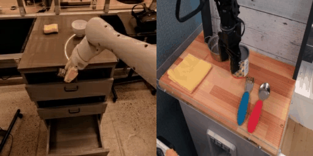
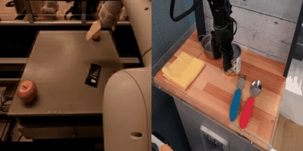
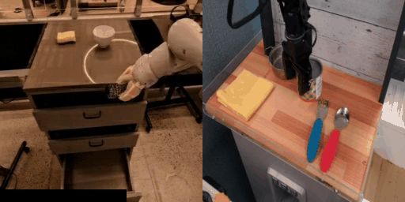
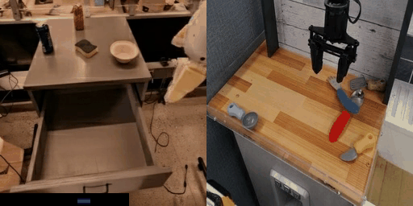

# Evaluating Robot Policies in a World Model [\[paper\]](https://arxiv.org/abs/2506.00613) [\[website\]](https://world-model-eval.github.io/abstract) [\[demo\]](https://world-model-eval.github.io/) 

<!-- GIF gallery -->
<div style="display: flex; gap: 10px;">
  
  
  
  
</div>

[Julian Quevedo](https://julian-q.github.io/)<sup>1</sup>, [Percy Liang](https://cs.stanford.edu/~pliang/)<sup>1</sup>, [Sherry Yang](https://sherryy.github.io/)<sup>1,2,3</sup>

Stanford University<sup>1</sup> &nbsp;&nbsp; New York University<sup>2</sup> &nbsp;&nbsp; Google DeepMind<sup>3</sup>


## Overview

This repository contains the implementation accompanying the paper [**Evaluating Robot Policies in a World Model**](https://arxiv.org/abs/2506.00613).  

News:
- 6/11/25: Initial training code release

TODO:
- [ ] Release dataset preparation scripts

---

## Installation

```bash
# Install PyTorch (replace cu124 with your local CUDA version)
pip install --upgrade pip
pip install torch torchvision torchaudio --index-url https://download.pytorch.org/whl/cu124

# Install other dependencies
pip install diffusers accelerate fire einops pytorchvideo tqdm imageio matplotlib
```

---

## Quick Start

```bash
python train.py
```

Multi-GPU training

```bash
# Replace N with the number of available GPUs
torchrun --nproc_per_node=N train.py
```

Checkpoints and generated GIF samples will be written to `outputs/<timestamp>/`.

---

## Citation

If you find this work useful, please cite:

```text
@misc{quevedo2025evaluatingrobotpoliciesworld,
      title={Evaluating Robot Policies in a World Model}, 
      author={Julian Quevedo and Percy Liang and Sherry Yang},
      year={2025},
      eprint={2506.00613},
      archivePrefix={arXiv},
      primaryClass={cs.RO},
      url={https://arxiv.org/abs/2506.00613}, 
}
```

---

## Acknowledgements
- [Boyuan Chen](https://boyuan.space/) and [Kiwhan Song](https://kiwhan.dev/) for [Diffusion Forcing](https://github.com/buoyancy99/diffusion-forcing)
- [DiT](https://github.com/facebookresearch/DiT)
- [Oasis](https://github.com/etched-ai/open-oasis)

